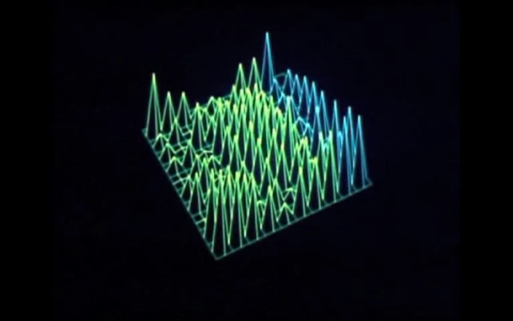
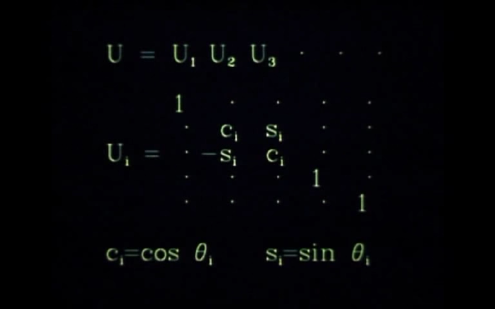

## Introduction

To create a similarly styled online version of the matrix decomposition shown in this 1976 film:

https://www.youtube.com/watch?v=R9UoFyqJca8

## Resources

This in part adapts:

Junior Rojas' code from his threeJS workshop at the Recurse Center

[RC Workshop] (https://juniorrojas.github.io/intro-3d-web/06-experimenting)

Lee Stemkoski's code 

[stemkoski] (https://stemkoski.github.io/Three.js/Shapes.html)
