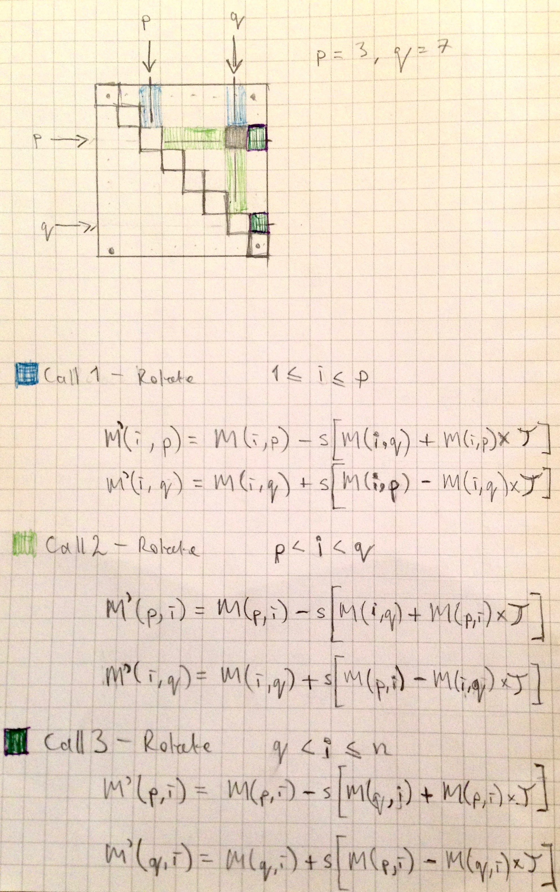

## Synopsis

This program visualises the progress of an algorithm that Diagonalizes a Symmetric Matrix. 

The grid represents an initial symmetric matrix that by successive Jacobi rotations is gradually transformed into a Diagonal matrix.

This process finds the Eigenvectors and Eigenvalues of the initial Symmetric Matrix.

## Motivation

* I thought that the Jacobi algorithm would lend itself to visualisation given that it at all stages preserves the symmetry of the symmetric matrix, whilst transforming it through successive rotations.
* To better understand how a PCA algorithm might work (because PCA amounts to a diagonalization of the (symmetric) covariance matrix)
* To produce some kind of algorithmic art

## Installation

Download and install Processing from http://www.processing.org.

## Notes

A still from a 1976 Matrix Singular Value Decomposition Film uploaded to YouTube by Cleve Moler, inventor of MATLAB.

## References

https://www.youtube.com/watch?v=R9UoFyqJca8

Eric Lengyel, Mathematics for 3D Game Programming and Computer Graphics

William H. Press et al, Numerical Recipes
